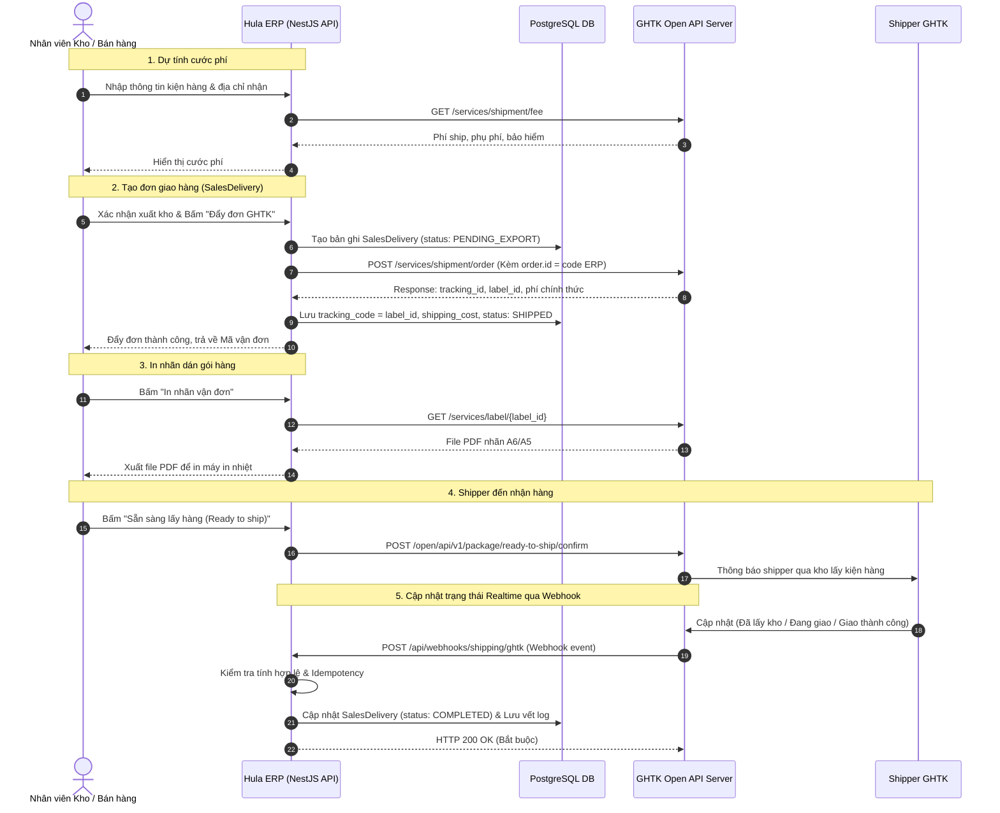

# Tài Liệu Tích Hợp API Nhà Cung Cấp Vận Chuyển GHTK (Giao Hàng Tiết Kiệm) Cho Hula ERP

Tài liệu này tổng hợp phân tích kỹ thuật và hướng dẫn kết nối hệ thống API của **Giao Hàng Tiết Kiệm (GHTK)** với hệ thống **Hula ERP**, dựa trên các cổng tài liệu chính thức:
* **GHTK Pro Open API Portal**: [https://pro-docs.ghtk.vn/](https://pro-docs.ghtk.vn/)
* **GHTK Submit Order Express Document**: [https://api.ghtk.vn/docs/submit-order/submit-order-express](https://api.ghtk.vn/docs/submit-order/submit-order-express)
* **GHTK Developer Portal**: [https://docs.giaohangtietkiem.vn/](https://docs.giaohangtietkiem.vn/)

---

## 1. Mục lục tài liệu

Bộ tài liệu tích hợp GHTK gồm 4 file chi tiết:

1. **[README.md](./README.md)** (Tài liệu này): Tổng quan môi trường, thông tin xác thực, kiến trúc kết nối và cấu hình hệ thống.
2. **[api-reference.md](./api-reference.md)**: Chi tiết toàn bộ các Endpoint API của GHTK (Đăng đơn, Tính phí, Tra cứu, Hủy đơn, In nhãn, Chuẩn hóa địa chỉ, Danh sách kho...).
3. **[webhook-and-status.md](./webhook-and-status.md)**: Đặc tả Webhook, bảng ánh xạ 25+ mã trạng thái đơn hàng (Order Statuses), bảng mã lý do (Reason Codes) và cơ chế Idempotency.
4. **[erp-integration-architecture.md](./erp-integration-architecture.md)**: Thiết kế giải pháp kỹ thuật tích hợp trực tiếp vào NestJS & TypeORM của Hula ERP (Service, DTOs, Webhook Handler, Database Schema Mapping).

---

## 2. Thông tin môi trường & Endpoint

GHTK cung cấp 2 môi trường riêng biệt:

| Tham số / Môi trường | Môi trường Thử nghiệm (STAGING) | Môi trường Thực tế (PRODUCTION) |
| :--- | :--- | :--- |
| **API Base URL** | `https://services-staging.ghtklab.com` | `https://services.giaohangtietkiem.vn` |
| **Portal Khách hàng (Shop)** | `https://khachhang-staging.ghtklab.com` | `https://khachhang.giaohangtietkiem.vn` |
| **Tracking URL Public** | `https://tracking-package.ghtklab.com/{uuid}` | `https://i.ghtk.vn/{tracking_code}` |
| **Mục đích** | Kiểm thử tạo đơn, test webhook, tính phí giả lập | Chạy vận hành đơn hàng thực tế |

---

## 3. Cơ chế xác thực (Authentication & Request Headers)

Mọi HTTP request gửi từ Hula ERP tới GHTK đều phải được xác thực qua **HTTP Headers**:

```http
Token: {API_TOKEN}
X-Client-Source: {PARTNER_CODE}
Content-Type: application/json
```

### Chi tiết các Headers:
1. **`Token`** *(Bắt buộc)*:
   - Chuỗi API Key bí mật của Shop được cấp bởi GHTK.
   - Vị trí lấy Token: Đăng nhập Cổng Khách hàng GHTK -> Vào mục *Thông tin shop / Tài khoản* (`/web/thong-tin-shop/tai-khoan`) -> Copy chuỗi `API Token`.
2. **`X-Client-Source`** *(Bắt buộc cho tài khoản Đối tác/Shop Pro)*:
   - Mã Shop hoặc Private Partner Code của doanh nghiệp (Ví dụ: `S308157`, `PACE_ERP`).
3. **`Content-Type`**:
   - GHTK hỗ trợ `application/json` (Khuyến nghị dùng cho Hula ERP) và `application/x-www-form-urlencoded`.

> [!CAUTION]
> Tuyệt đối không để lộ `API_TOKEN` trên frontend hoặc commit trực tiếp vào git repository. Mọi request gọi GHTK bắt buộc phải đi qua backend Hula ERP và lưu token trong biến môi trường (`.env`).

---

## 4. Định dạng phản hồi chuẩn (Standard Response Format)

### Khi xác thực thất bại:
```http
HTTP/1.1 403 Forbidden
Content-Type: application/json; charset=UTF-8
Content-Length: 0
```

### Khi xác thực thành công & xử lý hợp lệ:
```json
{
  "success": true,
  "message": "Thành công",
  "log_id": "ts680865040bdef",
  "data": { ... }
}
```

### Khi xảy ra lỗi nghiệp vụ:
```json
{
  "success": false,
  "message": "Mã đơn hàng của bạn đã tồn tại trên hệ thống GHTK",
  "error_code": "ORDER_ID_EXIST",
  "log_id": "d46808650ec14ff",
  "error": { ... }
}
```

---

## 5. Quy trình nghiệp vụ tích hợp tổng quát (Workflow)



---

## 6. Cấu hình biến môi trường (`.env`) cho Hula ERP

Thêm các cấu hình sau vào file `.env` của backend:

```env
# ==============================================================================
# CẤU HÌNH KẾT NỐI ĐỐI TÁC VẬN CHUYỂN GIAO HÀNG TIẾT KIỆM (GHTK)
# ==============================================================================

# Môi trường chạy: STAGING hoặc PRODUCTION
GHTK_ENVIRONMENT=STAGING

# Base URL API (Tự động chuyển tùy theo GHTK_ENVIRONMENT)
GHTK_API_URL=https://services-staging.ghtklab.com
# Production: https://services.giaohangtietkiem.vn

# API Token xác thực (Lấy trong tài khoản Shop GHTK)
GHTK_API_TOKEN=your_ghtk_api_token_here

# Partner Code / Shop Code (Mã đối tác GHTK cấp)
GHTK_PARTNER_CODE=your_partner_code_here

# Secret Hash kiểm tra tính bảo mật cho Webhook Callback URL
GHTK_WEBHOOK_SECRET_HASH=hula_erp_ghtk_webhook_secure_hash_2026

# Mã kho lấy hàng mặc định của công ty (pick_address_id lấy từ API list_pick_add)
GHTK_DEFAULT_PICK_ADDRESS_ID=88256

# Cấu hình tính cước mặc định: 1 = Shop trả ship (is_freeship=1), 0 = Khách trả ship
GHTK_DEFAULT_IS_FREESHIP=1
```

---

## 7. Các lưu ý then chốt khi triển khai

1. **Khối lượng sản phẩm tính bằng KILOGRAM (KG)**:
   - Các API tạo đơn (`/services/shipment/order`) yêu cầu khối lượng sản phẩm tính bằng `kg` (ví dụ `0.2` cho 200g).
   - Trong API tính phí (`/services/shipment/fee`), tham số `weight` lại tính bằng `gram` (`1000` = 1kg). Cần đặc biệt chú ý hàm converter.
2. **Quy tắc tính thu hộ COD & `is_freeship`**:
   - Nếu `is_freeship = 1`: Shipper chỉ thu người nhận số tiền đúng bằng `pick_money`.
   - Nếu `is_freeship = 0`: Shipper sẽ thu người nhận: `pick_money + phí ship`.
3. **Mã đơn hàng `order.id` là duy nhất**:
   - GHTK không cho phép gửi lại cùng 1 `order.id` đã đăng ký thành công.
   - Khi tạo đơn trong Hula ERP, sử dụng mã phiếu xuất `SalesDelivery.code` (VD: `DO-260905-001`). Nếu đơn lỗi phải tạo mã mới hoặc hậu tố (VD: `DO-260905-001-R1`).
4. **Phản hồi Webhook tức thì**:
   - Endpoint Webhook của Hula ERP bắt buộc phải trả về HTTP `200 OK` trong vòng **3 giây**. Việc xử lý cập nhật cơ sở dữ liệu nặng nên đưa vào queue (BullMQ/Redis) hoặc xử lý bất đồng bộ.
