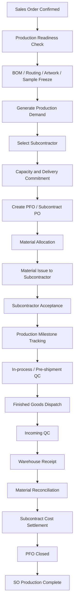

# PHÂN TÍCH WORKFLOW VÀ UI/UX MODULE QLSX

## HULA ERP – Quản lý thực hiện sản xuất thuê ngoài

**Phiên bản:** 1.0  
**Ngày:** 25/07/2026  
**Phạm vi:** Phân tích workflow, data model và UI/UX cho Module QLSX của HULA ERP trong mô hình HULA không sở hữu xưởng sản xuất, toàn bộ hoạt động sản xuất được thực hiện bởi các nhà gia công outsource.

---

# 1. Tóm tắt điều hành

Module QLSX của HULA không nên được thiết kế như một MES truyền thống dành cho nhà máy nội bộ. HULA không trực tiếp quản lý máy móc, chuyền may, công nhân, ca sản xuất hoặc OEE. Trọng tâm quản trị phải là kiểm soát xuyên suốt từ Sales Order đến khi hoàn tất giao hàng, bao gồm:

- BOM và định mức vật tư.
- Lập nhu cầu sản xuất.
- Lựa chọn và phân bổ nhà gia công.
- Cam kết năng lực và ngày giao.
- Cấp phát vật tư thuộc sở hữu HULA.
- Theo dõi tiến độ WIP theo lô và milestone.
- Kiểm soát chất lượng, rework và NCR.
- Nhập kho thành phẩm.
- Quyết toán vật tư và chi phí gia công.
- Cảnh báo rủi ro giao hàng theo nguyên tắc quản trị ngoại lệ.

Kiến trúc phù hợp nhất là **Outsourced Manufacturing Control Tower**, kết hợp ba lớp:

1. **MRP/ERP core:** BOM, vật tư, tồn kho, kế hoạch, chi phí.
2. **Apparel production tracking:** tech pack, mẫu duyệt, milestone, WIP, QC, rework.
3. **Supplier collaboration portal:** nhà gia công xác nhận năng lực, cập nhật tiến độ, gửi chứng từ và phản hồi lỗi.

Đơn vị điều phối trung tâm nên là **Production Fulfillment Order (PFO)** thay vì Manufacturing Order truyền thống.

---

# 2. Bối cảnh vận hành HULA

## 2.1 Đặc thù mô hình

HULA:

- Không có xưởng sản xuất riêng.
- Không quản lý trực tiếp công nhân hoặc máy.
- Có thể cấp toàn bộ, một phần hoặc không cấp vật tư cho nhà gia công.
- Có thể chia một Sales Order cho nhiều nhà gia công.
- Có thể chia sản phẩm thành nhiều công đoạn thuê ngoài.
- Cần bảo vệ ngày giao khách hàng, kiểm soát chất lượng và quyết toán vật tư.

## 2.2 Vấn đề cần giải quyết

Nếu Module QLSX chỉ dựa trên các biểu mẫu nghiệp vụ rời rạc, hệ thống sẽ phát sinh các vấn đề:

- Không có một trạng thái duy nhất phản ánh mức độ hoàn thành của SO.
- Thông tin tiến độ phân tán qua Zalo, điện thoại và bảng tính.
- Không biết chính xác vật tư nào đang nằm tại nhà gia công nào.
- Không dự báo được nguy cơ trễ trước ngày giao.
- Không quản lý được rework, hao hụt và chênh lệch định mức.
- Không đo lường được năng lực, chất lượng và độ tin cậy của từng nhà gia công.
- Khó xác định chi phí thực tế và ảnh hưởng biên lợi nhuận.

---

# 3. Benchmark hệ thống tham khảo

| Nhóm hệ thống | Điểm mạnh nên kế thừa | Hạn chế khi áp dụng nguyên trạng |
|---|---|---|
| Odoo MRP/Subcontracting | Subcontracting BOM, PO gia công, cấp vật tư cho nhà gia công, nhận thành phẩm | Thiên về transaction kho - kế toán; chưa đủ mạnh về control tower và critical path |
| ERPNext Subcontracting | Luồng PO gia công, BOM, cấp vật tư và Subcontracting Receipt rõ ràng | Form-heavy; cần mở nhiều chứng từ để hiểu toàn trạng thái |
| Apparel PLM/ERP | Tech pack, mẫu, nguyên liệu, costing, vendor, deadline và WIP | Nhiều chức năng collection/season/merchandising không phù hợp HULA |
| Apparel MES | Theo dõi WIP, lỗi, rework theo công đoạn | Quá sâu ở cấp công nhân, máy, bundle đối với doanh nghiệp không sở hữu xưởng |
| Supplier Collaboration Portal | Xác nhận PO/PFO, cập nhật trạng thái, chia sẻ tài liệu và evidence | Không thay thế được MRP, BOM và quản lý định mức |

## 3.1 Kết luận benchmark

HULA nên kế thừa:

- Transaction model về subcontracting từ ERP.
- Tech pack, sample approval và revision control từ apparel PLM.
- Milestone, WIP và defect tracking từ apparel MES.
- Mobile portal từ supplier collaboration platform.

HULA không nên triển khai:

- Work center nội bộ.
- Operator efficiency.
- Machine utilization.
- OEE.
- Chấm công sản xuất.
- Theo dõi từng bó hàng/bundle nếu không có yêu cầu thực sự.

---

# 4. Mô hình vận hành đề xuất

## 4.1 Đối tượng trung tâm: Production Fulfillment Order

Một PFO là lệnh điều phối sản xuất thuê ngoài cho một phần hoặc toàn bộ Sales Order.

```text
SO-2026-00125
├── PFO-001: Cắt foam – Nhà gia công A
├── PFO-002: May áo nệm – Nhà gia công B
├── PFO-003: Hoàn thiện và đóng gói – Nhà gia công C
└── PFO-004: Gia công trọn gói – Nhà gia công D
```

Một SO có thể:

- Giao trọn gói cho một nhà gia công.
- Chia nhiều công đoạn cho nhiều nhà gia công.
- Chia số lượng theo đợt.
- Thay nhà gia công giữa chừng.
- Phát sinh bổ sung vật tư.
- Phát sinh rework hoặc làm lại một phần.

## 4.2 Thay thế Work Center

Trong HULA ERP, Work Center nên được thay bằng các đối tượng:

- Subcontractor Site.
- Capability.
- Contracted Capacity.
- Committed Capacity.
- Available Capacity.
- On-time Performance.
- Quality Rating.
- Cost Rate.
- Lead Time Profile.

## 4.3 Nguyên tắc Plan by Exception

Trang chính phải trả lời ngay năm câu hỏi:

1. SO nào có nguy cơ trễ?
2. Nhà gia công nào chưa xác nhận?
3. PFO nào thiếu vật tư?
4. Milestone nào đang chậm?
5. Lô nào đang QC fail hoặc chờ nhập kho?

---

# 5. Workflow tổng thể



---

# 6. Control Gates

## Gate 1 – Production Readiness

### Mục tiêu
Xác nhận đơn hàng đã đủ điều kiện chuyển sang lập kế hoạch sản xuất.

### Điều kiện đầu vào

- SO đã được phê duyệt.
- Khách hàng đã đặt cọc hoặc được duyệt hạn mức công nợ.
- Artwork, màu, logo, kích thước và quy cách đã rõ.
- Ngày giao đã được xác nhận.
- Sản phẩm và UOM hợp lệ.

### Kiểm tra hệ thống

- BOM tồn tại.
- BOM đúng version.
- Routing gia công tồn tại.
- Sample/Artwork ở trạng thái Approved.
- Ngày bắt đầu kế hoạch phù hợp ngày giao.

### Output

`Production Ready = Yes`

### Hard stop

Không tạo Production Demand nếu chưa đạt toàn bộ điều kiện bắt buộc.

---

## Gate 2 – BOM & Routing Freeze

### Thành phần BOM

- Foam.
- Vải.
- Mút.
- Dây kéo.
- Chỉ.
- Logo.
- Nhãn.
- Túi.
- Carton.
- Phụ kiện.
- Hao hụt chuẩn.

### Routing tham khảo

```text
Cắt vật tư
→ Chần
→ May
→ Lồng ruột / ráp nệm
→ Kiểm tra
→ Vệ sinh
→ Đóng gói
```

### Quy tắc

- Không hard-code routing cho mọi sản phẩm.
- Routing được cấu hình theo product family và phương thức gia công.
- Sau khi PFO được phát hành, không sửa BOM trực tiếp.
- Mọi thay đổi phải tạo BOM Revision hoặc Engineering Change.
- Hệ thống phải tính ảnh hưởng vật tư, chi phí và ngày hoàn thành.

---

## Gate 3 – Sourcing Nhà gia công

### Tiêu chí chấm điểm đề xuất

| Tiêu chí | Trọng số |
|---|---:|
| Capability Match | 25% |
| Available Capacity | 20% |
| On-time Performance | 20% |
| Quality Rating | 20% |
| Cost | 10% |
| Distance / Logistics | 5% |

### Công thức

`Vendor Score = Σ(weight × normalized score)`

### Yêu cầu UI

| Nhà gia công | Năng lực | Ngày sớm nhất | Giá | OTD | QC Pass | Rủi ro |
|---|---:|---:|---:|---:|---:|---|
| NGC A | 1.200 sp/tháng | 28/07 | 42.000 | 94% | 97% | Thấp |
| NGC B | 800 sp/tháng | 30/07 | 39.000 | 82% | 92% | Cao |
| NGC C | 1.500 sp/tháng | 27/07 | 46.000 | 97% | 99% | Thấp |

Hệ thống phải lưu:

- Nhà gia công được hệ thống đề xuất.
- Nhà gia công được người dùng lựa chọn.
- Lý do override.
- Người phê duyệt override.

---

## Gate 4 – Capacity Commitment

Nhà gia công nhận PFO trên portal/mobile và có ba lựa chọn:

- Accept.
- Accept with revised date.
- Reject.

Không coi PFO là committed nếu chưa có xác nhận của nhà gia công.

### Dữ liệu hiển thị cho nhà gia công

- PFO.
- Sản phẩm.
- Số lượng.
- Ngày nhận vật tư.
- Ngày dự kiến bắt đầu.
- Ngày dự kiến hoàn thành.
- Ngày giao.
- Đơn giá.
- Tech pack.
- Tiêu chuẩn QC.

---

## Gate 5 – Material Availability

### Phân loại phương thức cung ứng

1. HULA cấp.
2. Nhà gia công tự cấp.
3. Mixed supply.

### Dữ liệu quản lý cho từng component

- Supply method.
- Warehouse.
- Planned quantity.
- Reserved quantity.
- Issued quantity.
- Consumed quantity.
- Returned quantity.
- Scrap quantity.
- Variance.

### Quy tắc

- Vật tư thuộc sở hữu HULA phải được theo dõi đến khi tiêu hao, hoàn trả hoặc xử lý chênh lệch.
- Không cho phép cấp vượt tolerance nếu chưa phê duyệt.

---

## Gate 6 – Material Issue

### Chứng từ

`Material Transfer to Subcontractor`

Không hạch toán như xuất bán.

### Trạng thái tồn kho

```text
HULA Warehouse
→ In Transit
→ At Subcontractor
→ Consumed
→ Returnable Balance
```

### Chức năng UI

- Scan QR.
- Giao một hoặc nhiều đợt.
- Ghi nhận giao thiếu.
- Cấp bổ sung.
- Trả lại vật tư.
- Xác nhận hai bên.
- Đính kèm biên bản.

---

## Gate 7 – Production Execution

HULA không cần quản lý từng thao tác công nhân. Chỉ theo dõi milestone cấp lô:

1. Material Received.
2. Cutting Started.
3. Cutting Completed.
4. Sewing / Quilting Started.
5. Sewing / Quilting Completed.
6. Assembly Started.
7. Production Completed.
8. Internal QC Completed.
9. Ready for Dispatch.

### Dữ liệu mỗi milestone

- Planned date.
- Actual date.
- Planned quantity.
- Completed quantity.
- Rejected quantity.
- WIP balance.
- Evidence photo.
- Issue note.
- Updated by.

---

## Gate 8 – Quality Control

### QC1 – Material / First Article

- Đúng vật liệu.
- Đúng màu.
- Đúng logo.
- Đúng kích thước.
- Đúng mẫu đầu tiên.

### QC2 – In-process QC

- Đường may.
- Độ căng.
- Kết cấu.
- Vị trí dây kéo.
- Vệ sinh.
- Ngoại quan.

### QC3 – Final / Incoming QC

- Số lượng.
- Kích thước.
- Lỗi may.
- Stain/dirt.
- Đóng gói.
- Nhãn.
- Carton.
- Barcode.

### Kết quả

- Pass.
- Conditional Pass.
- Rework.
- Reject.
- Concession Approved.

### Dữ liệu defect

- Defect Code.
- Severity.
- Quantity.
- Photo.
- Root Cause.
- Disposition.
- Responsible Party.
- Rework Due Date.
- Closure Evidence.

---

## Gate 9 – Finished Goods Receipt

Không nhập kho chỉ dựa trên Delivery Note.

### Điều kiện

- PFO ở trạng thái Ready for Dispatch.
- Có Delivery Note.
- Incoming QC hoàn tất.
- Accepted Quantity được xác định.
- Rejected Quantity được xác định.
- Lot/Batch hợp lệ.
- Packaging được xác nhận.

---

## Gate 10 – Material Reconciliation

### Công thức

`Expected Consumption = Accepted FG Qty × Standard BOM Qty`

`Variance = Issued - Returned - Expected Consumption`

### Phân loại chênh lệch

- Normal loss.
- Excess consumption.
- Damaged.
- Lost.
- Supplier-owned.
- Pending reconciliation.

### Điều kiện đóng PFO

Không đóng PFO nếu còn:

- Vật tư chưa quyết toán.
- Thành phẩm chưa nhận đủ.
- QC chưa đóng.
- Rework đang mở.
- Chi phí chưa xác nhận.

---

## Gate 11 – Subcontract Cost Settlement

### Cấu trúc chi phí

```text
Subcontract Fee
+ HULA Material Cost
+ Logistics Cost
+ QC Cost
+ Rework Cost
+ Scrap Cost
- Vendor Chargeback
```

### So sánh bắt buộc

- Standard Cost.
- Planned Cost.
- Committed Cost.
- Actual Cost.
- Variance.

---

# 7. Kiến trúc UI/UX

## 7.1 Production Control Tower

Đây là màn hình mặc định.

```text
┌─────────────────────────────────────────────────────────────┐
│ QLSX CONTROL TOWER             [This week] [All NGC] [Search]│
├─────────────────────────────────────────────────────────────┤
│ 128 PFO │ 16 At Risk │ 8 Material Short │ 5 QC Hold │ 92% OTD│
├─────────────────────────────────────────────────────────────┤
│ Critical Alerts                                             │
│ 🔴 PFO-0267 NGC Minh Phát — trễ 2 ngày                     │
│ 🔴 PFO-0274 thiếu 120m vải                                 │
│ 🟠 PFO-0281 chưa được nhà gia công xác nhận                 │
├─────────────────────────────────────────────────────────────┤
│ Production Timeline / Critical Path                         │
├─────────────────────────────────────────────────────────────┤
│ Nhà gia công │ Đang SX │ Trễ │ QC Hold │ Công suất sử dụng  │
└─────────────────────────────────────────────────────────────┘
```

### KPI card

- Active PFO.
- At-risk PFO.
- Material shortage.
- Pending vendor confirmation.
- QC hold.
- On-time completion.
- WIP value.
- Material at subcontractor.

Nguyên tắc: không hiển thị quá 8 KPI trên màn hình đầu.

---

## 7.2 SO Production Cockpit

Một màn hình hợp nhất toàn bộ tình trạng sản xuất của Sales Order.

### Header

- SO number.
- Customer.
- Committed delivery date.
- Status.
- Progress.
- Revenue at risk.

### Tabs

1. Overview.
2. PFO.
3. BOM & Material.
4. Milestones.
5. Quality.
6. Cost.
7. Documents.
8. Activity Log.

### Timeline

```text
Ready ✓
BOM Freeze ✓
NGC Confirm ✓
Material Issued ✓
Production 68%
QC Pending
Receipt Pending
Closed
```

---

## 7.3 PFO Board

Kanban theo trạng thái:

```text
DRAFT
PENDING APPROVAL
WAITING VENDOR
MATERIAL PREP
IN PRODUCTION
QC
READY TO SHIP
RECEIVING
RECONCILIATION
CLOSED
```

Card chỉ hiển thị:

- PFO number.
- SO / Customer.
- Product / Quantity.
- Vendor.
- Committed finish date.
- Progress.
- Risk badge.
- Blocker.

---

## 7.4 Gantt / Critical Path

Các dòng chính:

- Sales Order.
- PFO.
- Material Issue.
- Cutting.
- Sewing / Quilting.
- Assembly.
- QC.
- Dispatch.
- Receipt.

Chức năng:

- Baseline vs Actual.
- Dependency.
- Reschedule.
- Overdue indicator.
- Capacity conflict.
- Filter theo NGC/SO/Product.

---

## 7.5 Material Matrix

| Vật tư | Nhu cầu | Tồn khả dụng | Đã giữ | Đã cấp | Tại NGC | Thiếu | ETA |
|---|---:|---:|---:|---:|---:|---:|---|
| Foam D25 | 320 | 400 | 320 | 300 | 300 | 20 | 27/07 |
| Vải xanh | 980m | 600m | 600m | 600m | 600m | 380m | 30/07 |
| Logo ABC | 200 | 200 | 200 | 200 | 200 | 0 | — |

### UX rule

- Đỏ khi thiếu.
- Vàng khi ETA sát ngày cấp.
- Click vào số để drill-down.
- Cho phép reserve/issue từ bảng.
- Hỗ trợ bulk action.

---

## 7.6 Subcontractor Portal

Portal phải mobile-first.

### Menu chính

- New Orders.
- Orders to Confirm.
- Today’s Milestones.
- QC Issues.
- Shipments.
- Material Balance.

### Nguyên tắc thao tác

Tối đa ba bước:

1. Mở PFO.
2. Chọn milestone/trạng thái.
3. Nhập số lượng, chụp ảnh và submit.

### Phân quyền

- Chỉ thấy PFO được giao.
- Chỉ thấy BOM/tech pack cần thiết.
- Không thấy chi phí nội bộ.
- Không thấy nhà gia công khác.
- Không sửa master data.
- Mọi cập nhật có audit log.

---

## 7.7 Mobile QC

```text
[PFO Scan QR]

Product
Lot
Vendor
Inspection Plan

[PASS] [FAIL] [REWORK]

Defect:
○ May
○ Kích thước
○ Màu
○ Logo
○ Bẩn
○ Đóng gói
○ Khác

Severity:
○ Minor ○ Major ○ Critical

Qty:
[  ]

[Take Photo]
[Save & Next]
```

Mục tiêu UX: ghi nhận một lỗi trong dưới 30 giây.

---

# 8. Data Model

## 8.1 Master Data

- Product.
- Product Variant.
- BOM.
- BOM Revision.
- Routing.
- Operation.
- Material.
- Subcontractor.
- Subcontractor Site.
- Capability.
- Capacity Calendar.
- Quality Standard.
- Defect Catalog.
- Cost Rate.
- Lead Time Profile.

## 8.2 Transaction Data

- Sales Order.
- Production Demand.
- PFO.
- PFO Operation.
- PFO Milestone.
- Subcontract PO.
- Material Reservation.
- Material Issue.
- Subcontractor Stock.
- Production Update.
- Quality Inspection.
- NCR / Rework.
- Shipment.
- Goods Receipt.
- Material Reconciliation.
- Subcontract Cost Settlement.

## 8.3 Status Model

Không sử dụng một status duy nhất.

```text
PFO Lifecycle Status
Material Status
Production Status
Quality Status
Delivery Status
Financial Status
Risk Status
```

Ví dụ:

```text
PFO Status: In Production
Material Status: Complete
Production Status: 70%
Quality Status: Pending
Delivery Status: Not Ready
Financial Status: Open
Risk Status: Amber
```

---

# 9. Rule Engine

## 9.1 Hard Stops

- Không tạo PFO nếu chưa có BOM version.
- Không phát hành PFO nếu chưa chọn nhà gia công.
- Không cấp vật tư vượt tolerance nếu chưa duyệt.
- Không xác nhận Production Complete nếu completed quantity bằng 0.
- Không nhập kho nếu Incoming QC bắt buộc chưa pass.
- Không đóng PFO nếu chưa reconciliation.
- Không thanh toán đủ nếu còn NCR/chargeback mở.

## 9.2 Soft Warnings

- OTD nhà gia công dưới ngưỡng.
- Capacity overload.
- Material ETA sau production start.
- PFO không cập nhật quá 24 giờ.
- Actual consumption vượt BOM.
- QC fail rate vượt ngưỡng.
- Ngày hoàn thành dự báo sau committed date.

---

# 10. Dashboard

## 10.1 CEO / COO

- OTIF.
- SO at risk.
- Revenue at risk.
- WIP value.
- Top bottleneck.
- Vendor ranking.
- Material variance.
- Cost of poor quality.

## 10.2 Planning / CDA

- PFO due this week.
- Late milestones.
- Material shortage.
- Unconfirmed capacity.
- Reschedule queue.
- Critical path.
- Customer delivery risk.

## 10.3 Procurement / Warehouse

- Materials to issue.
- Materials at subcontractor.
- Return balance.
- Shortage by date.
- Aging subcontractor stock.
- Unreconciled material.

## 10.4 QA

- First pass yield.
- Defect Pareto.
- Rework aging.
- Vendor defect rate.
- Product defect rate.
- Open NCR.
- Cost of poor quality.

## 10.5 Finance

- PFO actual cost.
- Subcontract payable.
- Material variance value.
- Chargeback.
- Cost per SKU.
- Margin impact.

---

# 11. Kiến trúc Module HULA ERP

```text
HULA ERP
│
├── Sales Order
├── Product / BOM / Costing
├── QLSX Control Tower
│   ├── Production Demand
│   ├── PFO
│   ├── Subcontractor Allocation
│   ├── Capacity Commitment
│   ├── Material Control
│   ├── Milestone / WIP
│   ├── Quality / Rework
│   ├── Receipt / Reconciliation
│   └── Production Analytics
│
├── Procurement
├── Inventory
├── Finance
└── Vendor Portal
```

### Nguyên tắc tích hợp

QLSX không phải app tách biệt hoàn toàn. Module phải dùng chung:

- Product Master.
- BOM.
- Sales Order.
- Inventory Ledger.
- Supplier Master.
- Accounting.
- Document Management.
- Notification Service.
- Audit Log.

---

# 12. Phạm vi triển khai

## Phase 1 – Core Control

1. Production Demand.
2. PFO.
3. Subcontractor Assignment.
4. Material Planning.
5. Material Issue.
6. Milestone Updates.
7. QC.
8. Receipt.
9. Reconciliation.
10. Control Tower.

## Phase 2 – Collaboration

1. Vendor Portal.
2. Capacity Calendar.
3. Photo Evidence.
4. QR Scanning.
5. NCR / Rework.
6. Vendor Scorecard.
7. Notifications.

## Phase 3 – Intelligence

1. Delay Prediction.
2. Vendor Recommendation.
3. Material Shortage Prediction.
4. Cost Variance Alerts.
5. Automated ETA.
6. AI Document Validation.
7. AI Weekly Production Summary.

---

# 13. Yêu cầu phi chức năng

## 13.1 Auditability

- Mọi thay đổi status phải có timestamp và người thực hiện.
- Mọi override phải có lý do.
- Mọi attachment phải gắn đúng PFO/SO/milestone.
- Không xóa transaction đã post; chỉ cho reverse hoặc cancel theo quyền.

## 13.2 Mobile

- Vendor Portal và Mobile QC phải responsive.
- Hỗ trợ chụp ảnh trực tiếp.
- Tối ưu trong điều kiện mạng yếu.
- Cho phép lưu nháp và đồng bộ lại.

## 13.3 Security

- Row-level access theo vendor.
- Role-based access cho Planning, Warehouse, QA, Finance, CDA.
- Audit log không thể chỉnh sửa bởi người dùng thường.
- Tách quyền xem giá gia công và chi phí nội bộ.

## 13.4 Performance

- Control Tower tải dưới 3 giây với dữ liệu vận hành thông thường.
- Filter và drill-down không yêu cầu tải lại toàn bộ trang.
- Hỗ trợ phân trang và lazy loading cho lịch sử dài.

---

# 14. Quyết định thiết kế cuối cùng

Tên và phạm vi đúng của module:

## **QLSX – Quản lý thực hiện sản xuất thuê ngoài**

Module không bao gồm:

- Quản lý chuyền nội bộ.
- Quản lý công nhân.
- Quản lý máy.
- OEE.
- Chấm công sản xuất.
- Shop-floor MES.

Bốn màn hình cần ưu tiên phát triển:

1. Production Control Tower.
2. SO Production Cockpit.
3. PFO Board.
4. Material & Subcontractor Matrix.

Trọng tâm giá trị:

- Bảo vệ ngày giao khách hàng.
- Kiểm soát vật tư thuộc sở hữu HULA.
- Theo dõi tiến độ nhà gia công.
- Kiểm soát chất lượng.
- Quyết toán vật tư và chi phí.
- Đánh giá hiệu suất nhà gia công.
- Quản trị ngoại lệ thay vì kiểm tra thủ công từng lệnh.

---

# 15. Nguồn tham khảo

1. Odoo Documentation – Subcontracting.
2. Odoo Documentation – Subcontracting Resupply.
3. ERPNext Documentation – Subcontracting.
4. PolyPM – Apparel Production Software.
5. Stitch MES – Apparel Production Tracking.
6. Jakamo – Supplier Collaboration Platform.
7. Tài liệu tham khảo về mattress production line và quy trình may/chần nệm.
8. Nghiên cứu UX cho production planning và visualization.

> Lưu ý: Tài liệu này là bản phân tích nghiệp vụ và thiết kế giải pháp. Trước khi phát triển, HULA cần thực hiện workshop validation với Sales, Planning/CDA, Warehouse, QA, Procurement, Finance và đại diện nhà gia công.
