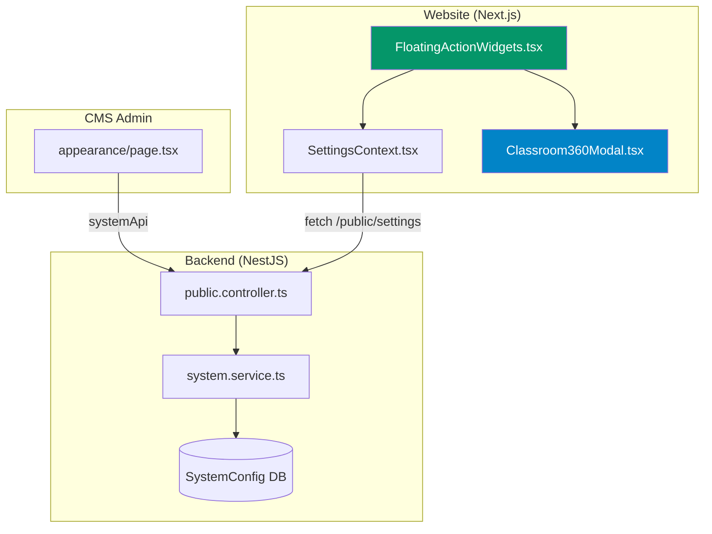
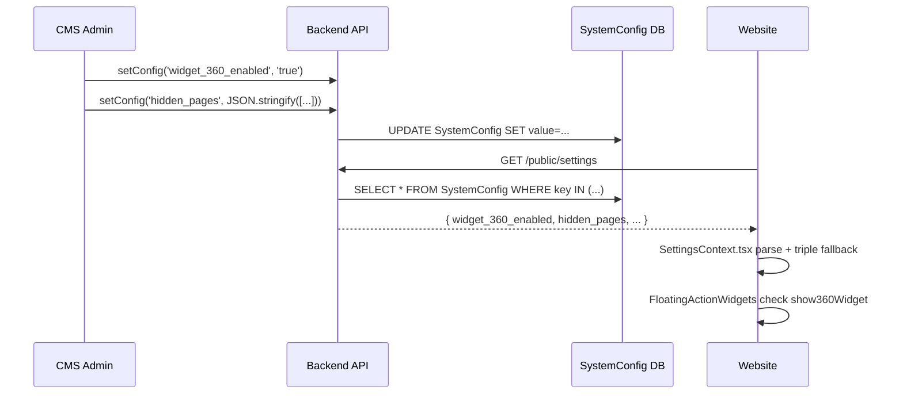
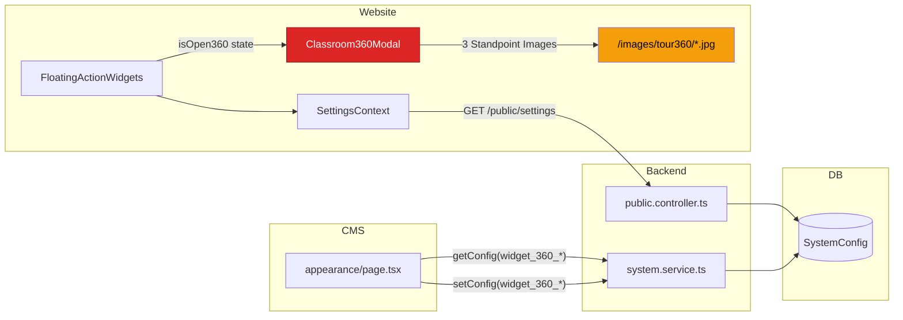

# 🔍 Code Review: Chức Năng 360° Tour / Classroom Experience

## Tổng Quan Kiến Trúc

Chức năng 360-degree tour được thiết kế như một **interactive showroom ảo** cho sản phẩm nệm mầm non HULA, cho phép khách hàng trải nghiệm không gian lớp học mầm non từ 3 góc nhìn khác nhau. Hệ thống bao gồm **7 files** chính trải dọc 3 layers: Backend → CMS → Website.



---

## 📁 File Map & Trách Nhiệm

| # | File | Layer | LOC | Trách nhiệm |
|---|------|-------|-----|-------------|
| 1 | [`Classroom360Modal.tsx`](file:///home/nt.nhan@pace.edu.vn/Documents/Github/hula-erp/hula-web/website/src/components/Classroom360Modal.tsx) | Website | **1720** | Component chính - toàn bộ UI/UX tour 360° |
| 2 | [`FloatingActionWidgets.tsx`](file:///home/nt.nhan@pace.edu.vn/Documents/Github/hula-erp/hula-web/website/src/components/FloatingActionWidgets.tsx) | Website | 135 | Floating button trigger mở modal 360° |
| 3 | [`SettingsContext.tsx`](file:///home/nt.nhan@pace.edu.vn/Documents/Github/hula-erp/hula-web/website/src/contexts/SettingsContext.tsx) | Website | 206 | Provider cho widget_360 settings |
| 4 | [`appearance/page.tsx`](file:///home/nt.nhan@pace.edu.vn/Documents/Github/hula-erp/hula-web/cms/src/app/appearance/page.tsx) | CMS | 1519 | Admin UI config widget 360 |
| 5 | [`public.controller.ts`](file:///home/nt.nhan@pace.edu.vn/Documents/Github/hula-erp/src/public/public.controller.ts) | Backend | 958 | API endpoint trả settings cho frontend |
| 6 | [`system.service.ts`](file:///home/nt.nhan@pace.edu.vn/Documents/Github/hula-erp/src/system/system.service.ts) | Backend | 642 | Đọc/ghi config từ DB |

---

## 🏗️ Cấu Trúc Dữ Liệu Chính

### 1. SystemConfig Keys (Database)

| Key | Type | Mô tả |
|-----|------|-------|
| `widget_360_enabled` | `boolean` as string | Bật/tắt widget 360° |
| `widget_360_tooltip` | `string` | Text tooltip khi hover icon |
| `widget_360_badge` | `string` | Badge nhỏ trên icon (mặc định "360°") |
| `widget_360_panorama_url` | `string` | URL ảnh panorama custom (chưa sử dụng trong modal!) |
| `hidden_pages` | `JSON string[]` | Sync ẩn/hiện qua hidden_pages array |

### 2. TypeScript Data Model ([Classroom360Modal.tsx:9-96](file:///home/nt.nhan@pace.edu.vn/Documents/Github/hula-erp/hula-web/website/src/components/Classroom360Modal.tsx#L9-L96))

```typescript
// 3 loại góc đứng (standpoint) trong showroom
type StandpointId = 'classroom' | 'cubby' | 'macro';

// 3 nhân vật POV (character)
type CharacterId = 'teacher' | 'parent' | 'student';

// Mỗi character có 4 scenario steps với action detail
interface ScenarioStep {
    step: number;
    timeTag: string;          // "11:30 Trưa"
    title: string;
    monologue: string;        // Lời thoại kể chuyện
    standpoint: StandpointId; // Auto-navigate đến standpoint
    targetYaw: number;        // Camera target angle
    targetPitch: number;
    actionDetail: {...};      // Content khi click CTA
}

// 5 hotspot tương tác trên panorama
interface Hotspot {
    id: string;
    standpoint: StandpointId | 'all';
    yaw: number; pitch: number;  // Vị trí trong panorama
    label: string;
    quote: { text, source, school, link };
    highlights: string[];
    specs: { label, value }[];
}
```

---

## 🎯 Luồng Hoạt Động Chi Tiết

### Flow 1: Bật/Tắt Widget 360 (Admin → Website)



> [!WARNING]
> **Over-engineering trên logic bật/tắt**: Hiện tại có **3 lớp kiểm tra chồng chéo** để xác định widget có bật không: (1) `hidden_pages` array, (2) `widget_360_enabled` key, (3) `localStorage` fallback. Logic này được duplicate ở **3 nơi**: SettingsContext, FloatingActionWidgets, và CMS appearance page.

### Flow 2: Trải Nghiệm Tour 360° (User Interaction)

```
1. User click nút 360° (FloatingActionWidgets) 
   → setIsOpen360(true)
   → Classroom360Modal mở fullscreen

2. Character Selection Screen
   → Chọn 1 trong 3 nhân vật (Teacher/Parent/Student)
   → Camera chuyển đến initialStandpoint + initialYaw/Pitch

3. Scenario Timeline
   → Mỗi character có 4 bước kịch bản (scenario steps)
   → Auto-pan camera đến targetYaw/Pitch mỗi step
   → Hiện speech bubble với monologue + action button

4. Tương Tác Panorama Canvas
   → Drag/touch để xoay 360° (free look)
   → Scroll wheel để zoom in/out
   → Click hotspot để xem chi tiết sản phẩm
   → "Soi Cấu Trúc" mở Material Inspector modal

5. Sub-Modals:
   → Hotspot Detail Inspector (ảnh + specs + quote)
   → Scenario Action Detail (bullet points + project link)
   → Macro Material Inspector (elasticity simulator)
```

---

## 🔬 Phân Tích Kỹ Thuật Component Chính

### [`Classroom360Modal.tsx`](file:///home/nt.nhan@pace.edu.vn/Documents/Github/hula-erp/hula-web/website/src/components/Classroom360Modal.tsx) — 1720 dòng

#### A. Rendering Engine (Canvas 2D)
- **Kỹ thuật**: HTML5 Canvas 2D equirectangular panorama projection
- **Rendering loop**: `requestAnimationFrame` 60FPS ([line 893-1010](file:///home/nt.nhan@pace.edu.vn/Documents/Github/hula-erp/hula-web/website/src/components/Classroom360Modal.tsx#L893-L1010))
- **Image tiling**: Wrap panorama image horizontally để tạo hiệu ứng 360°
- **Effects**: Vignette overlay + Colorway tint (soft-light compositing)
- **Camera controls**: Drag-to-pan, wheel-to-zoom, smooth interpolation

```
Canvas Pipeline:
  1. Clear canvas
  2. Calculate draw position from yaw/pitch/zoom
  3. Tile panoramic image across viewport (startTile → endTile)
  4. Apply luxury vignette gradient
  5. Apply colorway tint (if non-default)
  6. Overlay HTML hotspot markers via position calculation
```

> [!NOTE]
> **Không phải true 360° projection** — Đây là flat 2D image panning (equirectangular scroll), không phải WebGL spherical/cube-map projection. Ảnh panorama được "tile" ngang và scroll dọc, tạo hiệu ứng giả 360°. Hiệu ứng tốt với ảnh wide-angle nhưng sẽ bị distortion nếu dùng ảnh equirectangular 2:1 thật.

#### B. State Management — 15+ state variables
- **Character/Scenario**: `selectedCharacter`, `currentStepIndex`, `isFreeLook`
- **Camera**: `yaw`, `pitch`, `zoom`, `isAutoRotate`, `isFullscreen`
- **Standpoint/Color**: `activeStandpoint`, `activeColorway`, `showColorPicker`
- **Modals**: `activeHotspot`, `activeActionModal`, `inspectorTab`, `elasticityPressed`
- **Audio**: `isAudioMuted`, `audioCtxRef`, `audioTimerRef`
- **Canvas**: `canvasRef`, `isDraggingRef`, `lastMousePosRef`, `targetYawRef/PitchRef`, `imagesRef`, `imagesLoaded`

#### C. Audio System ([line 801-856](file:///home/nt.nhan@pace.edu.vn/Documents/Github/hula-erp/hula-web/website/src/components/Classroom360Modal.tsx#L801-L856))
- Web Audio API synthesizer tạo nhạc ru lofi (music box chime)
- Melody: C-C-E-C-E-G-E-C-D-E-D ở interval 1.4s
- Volume rất nhỏ (0.04) với exponential decay

#### D. 3 Built-in Sub-Modals
1. **Hotspot Detail Inspector** ([line 1422-1521](file:///home/nt.nhan@pace.edu.vn/Documents/Github/hula-erp/hula-web/website/src/components/Classroom360Modal.tsx#L1422-L1521)): Ảnh + highlights + specs grid + customer quote
2. **Scenario Action Detail** ([line 1526-1597](file:///home/nt.nhan@pace.edu.vn/Documents/Github/hula-erp/hula-web/website/src/components/Classroom360Modal.tsx#L1526-L1597)): Bullet points + project link
3. **Material Inspector** ([line 1602-1716](file:///home/nt.nhan@pace.edu.vn/Documents/Github/hula-erp/hula-web/website/src/components/Classroom360Modal.tsx#L1602-L1716)): Layer callouts + elasticity simulator + certifications

#### E. Hardcoded Content Volume

| Data Type | Count | Lines |
|-----------|-------|-------|
| Standpoints | 3 | [100-134](file:///home/nt.nhan@pace.edu.vn/Documents/Github/hula-erp/hula-web/website/src/components/Classroom360Modal.tsx#L100-L134) |
| Colorways | 4 | [139-172](file:///home/nt.nhan@pace.edu.vn/Documents/Github/hula-erp/hula-web/website/src/components/Classroom360Modal.tsx#L139-L172) |
| Characters | 3 (Teacher/Parent/Student) | [177-530](file:///home/nt.nhan@pace.edu.vn/Documents/Github/hula-erp/hula-web/website/src/components/Classroom360Modal.tsx#L177-L530) |
| Scenarios | 12 (4 per character) | distributed |
| Hotspots | 5 | [535-701](file:///home/nt.nhan@pace.edu.vn/Documents/Github/hula-erp/hula-web/website/src/components/Classroom360Modal.tsx#L535-L701) |
| **Tổng text content** | ~350 dòng | ~20% file |

---

## ⚠️ Các Vấn Đề Cần Nâng Cấp

### 🔴 Critical Issues

| # | Vấn đề | File | Mô tả |
|---|--------|------|-------|
| 1 | **Monster Component** | Classroom360Modal | 1720 LOC trong 1 file duy nhất, mix data + logic + UI + 3 sub-modals |
| 2 | **100% Hardcoded Content** | Classroom360Modal | Toàn bộ standpoints, characters, scenarios, hotspots đều hardcode trong code |
| 3 | **Fake 360°** | Classroom360Modal | Canvas 2D flat panning, không phải WebGL spherical projection thực sự |
| 4 | **`widget_360_panorama_url` không được sử dụng** | Settings → Modal | CMS có field panorama URL nhưng Classroom360Modal **không đọc** giá trị này, luôn dùng hardcoded paths |
| 5 | **Triple-redundant enable/disable logic** | 3 files | Logic bật/tắt widget chép lại 3 lần ở SettingsContext, FloatingActionWidgets, CMS appearance page |

### 🟡 Important Issues

| # | Vấn đề | File | Mô tả |
|---|--------|------|-------|
| 6 | **Re-render loop risk** | Classroom360Modal | rAF loop phụ thuộc 10+ state values trong dependency array, mỗi setState trigger re-render |
| 7 | **No image error handling** | Classroom360Modal | Nếu panorama images fail load, canvas chỉ hiện gradient fallback, không retry |
| 8 | **Hardcoded phone number** | Modal footer L1411 | `tel:0983882210` hardcoded thay vì dùng settings context |
| 9 | **No lazy loading** | FloatingActionWidgets | Import `Classroom360Modal` trực tiếp, ~98KB component load ngay cả khi user không click |
| 10 | **Missing accessibility** | Classroom360Modal | Canvas không có aria labels, keyboard navigation hạn chế (chỉ ESC) |
| 11 | **`'use client'` duplicate** | appearance/page.tsx L1-2 | `'use client'` xuất hiện 2 lần ở đầu file |
| 12 | **No responsive breakpoint** | Inspector modals | Sub-modals dùng fixed max-width, không tối ưu cho mobile nhỏ |

### 🟢 Nice-to-have Improvements

| # | Cải tiến | Mô tả |
|---|---------|-------|
| 13 | **CMS-driven content** | Cho phép admin chỉnh sửa characters, scenarios, hotspots từ CMS |
| 14 | **True WebGL 360°** | Dùng Three.js/Pannellum cho spherical projection thực sự |
| 15 | **Analytics tracking** | Theo dõi user interaction (character chọn, hotspot click, thời gian ở mỗi step) |
| 16 | **Image CDN optimization** | Panorama images nặng, cần resize + webp + lazy load |
| 17 | **Virtual Tour linking** | Liên kết hotspots với trang sản phẩm/dự án thực tế |
| 18 | **Multi-language** | Hardcoded content 100% tiếng Việt |

---

## 📊 Tóm Tắt Dependency Flow



> [!IMPORTANT]
> **Key finding**: `Classroom360Modal.tsx` là file **tự chứa hoàn toàn** (self-contained) — 98.5KB, không nhận bất kỳ dynamic content nào từ CMS/API ngoại trừ prop `settings` (chỉ dùng cho reference, không ảnh hưởng nội dung). Toàn bộ text, data, images đều hardcoded. Điều này có nghĩa nâng cấp chức năng này sẽ chủ yếu tập trung vào việc **tách data ra khỏi component** và **kết nối với CMS API**.

---

## 🗂️ Static Assets Sử Dụng

| Image Path | Standpoint | Dùng ở |
|------------|-----------|--------|
| `/images/tour360/classroom_wide.jpg` | `classroom` | Main panorama + action previews |
| `/images/tour360/cubby_nap.jpg` | `cubby` | Main panorama + action previews |
| `/images/tour360/mattress_macro.jpg` | `macro` | Main panorama + inspector |

> [!NOTE]
> Chỉ có **3 ảnh** được sử dụng cho toàn bộ tour. Mỗi ảnh vừa là panorama background vừa là preview thumbnail trong các modals. `widget_360_panorama_url` từ CMS settings **chưa được kết nối** vào component.
