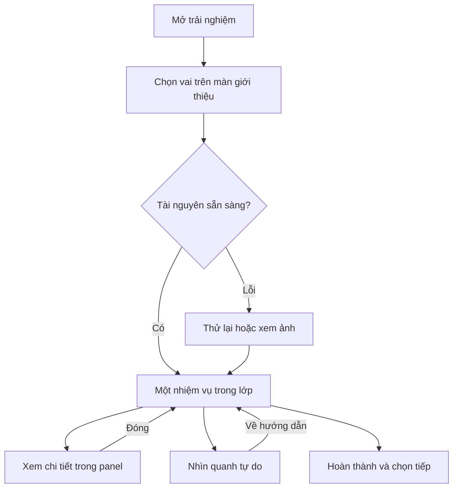

# HULA 360 — Phân tích flow và thiết kế trải nghiệm cập nhật

Ngày: 08/09/2026 · Phiên bản 1.0 · Đầu vào: “Đã dán markdown (1).md”, báo cáo Code Review chức năng 360°.

## 1. Kết luận và phạm vi bằng chứng

Theo tài liệu được cung cấp, hệ thống đã có đường đi CMS → cấu hình công khai → widget → modal → ba vai → timeline → xem chi tiết. Đây là nền có thể cải tiến, nhưng phần tương tác được mô tả vẫn là xem ảnh và nội dung. Chưa có bằng chứng trong file về camera theo mắt nhân vật, rig tay và hành động nhận–trải–gấp–cất ở một lớp học 3D.

Ưu tiên đề xuất: làm đúng cấu hình và nội dung; giảm gián đoạn khi điều khiển; cải thiện giao diện và tải tài nguyên; sau đó hoàn thiện renderer và hành động ngôi thứ nhất. Tách component là phương tiện để làm được các thay đổi này, không phải mục tiêu nghiệm thu duy nhất.

**Đã đọc toàn bộ báo cáo đính kèm; chưa đọc source repo hoặc chạy phiên bản website tương ứng báo cáo.** Tất cả lỗi cụ thể trong báo cáo được xem là đầu mối cần AI IDE xác minh. Đường dẫn, số dòng và LOC không phải bằng chứng source còn ở nguyên trạng.

### Các điểm cần hiệu chỉnh trong cách đọc báo cáo

| Nội dung báo cáo | Cách hiểu chính xác để giao việc |
|---|---|
| “7 files” nhưng bảng liệt kê 6 | Kiểm repo để xác định đủ file liên quan; không tự tìm một file thứ bảy cho khớp số |
| rAF “60 FPS” | Có rAF không đồng nghĩa đo được 60 fps; tốc độ phụ thuộc màn hình và tải [R3] |
| File khoảng 98 KB | Đây là kích thước source được báo cáo, chưa phải JS nén thực tế tải qua mạng |
| 10+ dependency gây re-render loop | Là rủi ro; cần profiler, đếm loop và kiểm cleanup để kết luận lỗi thật |
| Ảnh tile ngang bị gọi “equirectangular projection” | Nếu đúng chỉ là flat panning, không phải phép chiếu cầu; cần đọc renderer và kiểm ảnh |
| Hardcode nội dung được xếp Critical | Ưu tiên theo tác động: sai lời/claim/cấu hình cần sửa trước; đưa mọi thứ vào CMS có thể chia giai đoạn |
| Sơ đồ CMS ghi qua public controller | Chưa đủ chứng minh API ghi là public; kiểm route, guard và đường gọi thật |
| Material Inspector có certifications/elasticity | Cần đối chiếu nội dung và nguồn; không mặc định có chứng nhận hợp lệ hoặc mô phỏng vật lý đáng tin |

## 2. So sánh hiện tại với trải nghiệm đã thống nhất

| Trục | Hiện tại theo báo cáo | Đích cần đạt |
|---|---|---|
| Nhân vật | teacher/parent/student thay nội dung, 4 bước mỗi vai | Cô An/mẹ Linh/Mây có camera, tay, sự kiện và hành động phù hợp |
| Không gian | 3 ảnh: classroom, cubby, macro | Một lớp học nhất quán; điểm đứng tách khỏi bảng xem cấu tạo |
| Hành động | CTA mở bullet points/project link | CTA thực hiện một việc; nút đọc thêm là lựa chọn phụ |
| Điều khiển | Auto-pan mỗi bước + kéo tự do + zoom | Người dùng có quyền ưu tiên; kéo là dừng auto-pan ngay |
| Chi tiết | 3 sub-modal cùng component | Một vùng thông tin theo ngữ cảnh, đóng là trở lại đúng bước |
| Màu sắc | Tint soft-light cả cảnh | Đổi đúng vật liệu/biến thể sản phẩm khi có dữ liệu; không đổi màu cả phòng |
| Nội dung | Local constants, setting panorama bỏ qua | Một nguồn dữ liệu đã chuẩn hóa, có version và tài nguyên đúng loại |
| Trẻ | Cùng nền nội dung chứa specs/quote/certifications | Chế độ cùng bé chỉ có nhiệm vụ/hình/lời ngắn, không thương mại |

Không cần ép 4 bước hiện tại thành 6 bước bằng cách kéo dài văn bản. Giữ các chương dễ hiểu, bên trong là các hành động ngắn. Storyboard 6 khung của mỗi vai là tài liệu tham chiếu hình ảnh; số bước runtime phải theo hành động và khả năng của renderer.

## 3. Những thay đổi ưu tiên

| Mã | Ưu tiên | Vấn đề theo báo cáo hoặc khoảng cách mục tiêu | Thay đổi và kết quả nghiệm thu |
|---|---|---|---|
| F01 | P0 | CMS bật/tắt có nhiều nguồn và cache cũ | Một hàm chuẩn hóa và một policy hiển thị; explicit false từ server không bị localStorage bật lại |
| F02 | P0 | Panorama URL không tới renderer | Ràng buộc field với scene/asset cụ thể; xem trước đúng asset trong CMS và website |
| F03 | P0 | Claim/certification/quote chưa rõ nguồn | Chỉ hiển thị dữ liệu được xác nhận; bỏ mô phỏng độ đàn hồi mang tính đo lường khi chưa có cơ sở |
| F04 | P0 | Dùng ảnh không đúng loại cho 360 | Phân loại asset; ảnh thường dùng chế độ ảnh; panorama chuẩn dùng cầu; 3D dùng model |
| F05 | P1 | Auto-pan và kéo tranh quyền | Quyền điều khiển rõ; kéo hủy chuyển động tự động, có nút Về điểm hướng dẫn |
| F06 | P1 | Popup liên tiếp làm mất mạch | Gộp một inspector panel, không stack nhiều backdrop; đóng về đúng bước/camera |
| F07 | P1 | Ảnh lỗi chỉ còn gradient | Poster + trạng thái tải/lỗi + retry và chế độ ảnh; tránh spinner vô hạn |
| F08 | P1 | Tour import ngay từ widget | Shell nhẹ, tải renderer/content theo nhu cầu; đo network/build thật [R1] |
| F09 | P1 | UI mobile/keyboard yếu | Bottom sheet có giới hạn chiều cao, nút lớn, quản lý focus và thoát rõ [R2] |
| F10 | P1 | rAF/audio gắn nhiều state | Một loop hoạt động, cleanup tài nguyên, pause khi ẩn hoặc đóng |
| F11 | P1 | Component trộn mọi trách nhiệm | Tách dữ liệu, state, viewer, panel, controls và media; không chỉ chia theo số dòng |
| F12 | P2 | Nhập vai chưa có hành động 3D | Thực hiện scene 3D POV theo instruction trước; nghiệm thu riêng với tour panorama |
| F13 | P2 | Nội dung CMS chưa quản trị được | Seed dữ liệu cấu trúc trước; thêm editor, preview và publish version sau khi contract ổn định |

P0 ở đây là ưu tiên sửa trong đợt nâng cấp, không khẳng định sự cố bảo mật/production đã được chứng minh.

## 4. Flow khách tham quan đề xuất

### 4.1. Mở và chọn vai

Widget giữ vị trí ổn định, không che liên hệ hoặc nút mua đang có. Tooltip bổ sung cho desktop; nút vẫn có tên đọc được trên touch/screen reader. Bấm mở shell ngay; không chờ tải mọi ảnh/renderer mới cho thấy phản hồi.

Một màn mở đầu có tên “Một ngày ở lớp cùng Hula”, mô tả một câu và ba thẻ nhân vật. Bấm thẻ là bắt đầu hành trình có hướng dẫn khi cảnh đầu sẵn sàng; không thêm màn chọn chế độ bắt buộc. “Khám phá tự do” là lựa chọn phụ sau khi vào lớp.

Nếu renderer chưa hỗ trợ hành động POV, tên/mô tả phải phản ánh nội dung hiện có, ví dụ “Tham quan lớp học”. Không dùng nhãn đã “nhập vai thao tác” cho tour chỉ có ảnh và thông tin.

### 4.2. Trong một bước

Mỗi bước có tên nhiệm vụ, tối đa một câu lời dẫn, một nút hành động chính. Ví dụ cảnh cô An: “Nhận đúng bộ đồ” → “Xem ký hiệu”, không mở modal có hàng loạt bullet rồi bắt người dùng tìm đường quay lại.

“Tiếp tục” chuyển bước khi người dùng chủ động. Hoàn thành animation không được tự kéo sang cảnh mới trong lúc khách còn đọc. Nút “Xem chi tiết” không đánh dấu hoàn thành hành động 3D.

Khi kéo nhìn quanh, chuyển sang chế độ tự do nhưng giữ bước hiện tại. Hiện nút “Về điểm hướng dẫn”; không tự lấy lại quyền điều khiển sau vài giây. Mở inspector tạm dừng camera và hành động; đóng panel khôi phục đúng trạng thái.

### 4.3. Kết thúc và chuyển vai

Kết thúc hiển thị một lựa chọn chính: Xem lại hoặc Xem mẫu đang trải nghiệm, tùy có SKU xác minh. Lựa chọn phụ là chọn vai khác. Chế độ cùng bé chỉ có Hoàn thành/Xem lại/Trở về cùng người lớn.

“Xem cùng thời điểm” chỉ xuất hiện khi có scene/sự kiện thực sự dùng chung và state đủ thông tin. Nếu hiện tại chỉ có ba timeline độc lập, dùng “Bắt đầu hành trình của…”; không giả lập chuyển góc nhìn cùng một sự kiện.

## 5. Blueprint giao diện

### 5.1. Thứ bậc thị giác

Giữ nhận diện Hula, màu xanh ngọc làm hành động chính, nền kem/trắng làm panel, chữ xanh đậm. Giảm vignette để sản phẩm rõ; bỏ lớp tint phủ cả phòng. Ưu tiên cảnh rộng và ít nút nổi.

Token đề xuất, cần thử tương phản khi áp dụng: accent trang trí #20A7C8; nút chính nền #087F9C với chữ trắng; chữ #153F49; nền #F7FAF9; panel #FFFFFF. Không dùng chữ trắng nhỏ trên cyan sáng nếu chưa đạt tương phản.

| Vùng | Desktop từ 1024 px | Tablet 768–1023 px | Mobile dưới 768 px |
|---|---|---|---|
| Mở đầu | 3 thẻ nhân vật ngang | 3 thẻ gọn hoặc xếp phù hợp | 3 thẻ dọc, ảnh nhỏ và mô tả một dòng |
| Thanh đầu | Tên vai, âm thanh, trợ giúp, đóng | Rút gọn tên trải nghiệm | Cao khoảng 56 px + safe area, không tràn ngang |
| Scene | Chiếm phần lớn diện tích | Scene ưu tiên chiều cao | Dùng dynamic viewport height; không ép xoay ngang |
| Nhiệm vụ | Card đáy rộng tối đa khoảng 520 px | Card ngắn | Bottom card gọn, nút chính luôn thấy |
| Inspector | Panel phải 360–400 px | Panel phù hợp phần còn lại | Bottom sheet, mặc định tối đa khoảng 60% chiều cao khả dụng |
| Bộ điều khiển | Nhóm ít nút tại góc không che nhiệm vụ | Tăng vùng chạm | Gộp tùy chọn phụ vào menu; tránh icon dày đặc |

Các breakpoint/kích thước trên là mục tiêu thiết kế, điều chỉnh theo hệ thống UI thực tế. Kiểm màn 360×800, 390×844, 768×1024, 1024×768 và 1440×900; không coi viewport mô phỏng là thiết bị thật.

Bo góc panel khoảng 16–20 px, khoảng cách theo nhịp 8 px; nội dung 16 px trở lên khi có thể. Thẻ nhân vật nhấn bằng ảnh và mô tả vai, không thêm nhiều badge/gradient/hiệu ứng nhấp nháy. Hotspot tối đa 3–4 điểm nổi bật cùng lúc; điểm ngoài góc nhìn có trong danh sách “Điểm khám phá”.

### 5.2. Một vùng xem chi tiết

Gộp Hotspot Detail, Action Detail và Material Inspector vào một inspector có nội dung theo ngữ cảnh. Tab đề xuất “Sản phẩm / Cách dùng / Thông tin”, chỉ hiện tab có dữ liệu. Mở nội dung mới thay nội dung hiện tại, không mở thêm lớp modal.

`macro` chuyển thành nội dung xem cận trong inspector, không là một điểm đứng giữa lớp nếu asset chỉ là ảnh vải. Đóng inspector về đúng viewpoint/step, không quay về màn chọn vai. Dùng CTA xem dự án ở cuối thông tin khi có link và nguồn thật.

Modal toàn màn hình CSS và browser Fullscreen API là hai việc khác nhau; không tự yêu cầu fullscreen. Nếu có nút fullscreen, đó là tùy chọn, cần đồng bộ khi người dùng thoát bằng hệ điều hành.

## 6. Chuyển động và trải nghiệm mượt

Các giá trị dưới đây là đề xuất để thử, không phải số đo hiện trạng:

- Phản hồi nút/selected state: khoảng 120–180 ms.
- Mở/đóng panel: khoảng 180–240 ms, chủ yếu opacity/transform.
- Chuyển điểm nhìn: khoảng 250–450 ms sau khi asset mới đã sẵn sàng; giữ ảnh cũ trong khi tải.
- Hướng camera tới mục tiêu: khoảng 400–700 ms cho góc nhỏ; chọn hướng quay ngắn nhất qua biên ±180°. Góc lớn ưu tiên chuyển mờ thay vì xoay dài.
- Người dùng kéo hoặc giảm chuyển động: hủy/tắt chuyển động camera tự động ngay. Không bật auto-rotate mặc định.

Không đặt React state cho yaw/pitch mỗi frame nếu không cần UI render; camera dùng state nội bộ renderer, state nghiệp vụ chỉ cập nhật ở ranh giới hợp lý. Quản lý một chủ thể điều khiển camera trong mỗi thời điểm: người dùng, hướng dẫn, animation hoặc inspector.

Lofi chime theo báo cáo là nhạc tổng hợp, không phải giọng nhân vật. UI tách “Âm thanh nền” và “Lời dẫn” nếu thật sự có cả hai; mặc định im lặng. Thiếu voice thì phụ đề vẫn hoạt động. Đóng tour phải dừng timer/âm thanh và render loop của instance đó.

## 7. Phân biệt đúng ba loại hiển thị

| Loại | Dữ liệu cần | Có thể công bố | Không được công bố |
|---|---|---|---|
| `guided2d` | Ảnh thường và nội dung | Xem ảnh có hướng dẫn | Phòng 360 thật hoặc thao tác vật thể 3D |
| `panorama360` | Panorama cầu/cubemap hợp lệ, góc nhìn đúng điểm chụp | Nhìn quanh 360 tại điểm cố định | Tay lấy/gấp sản phẩm thật hoặc tầm mắt trẻ chỉ bằng crop |
| `scene3d` | Scene/model/rig/animation phù hợp | POV và hành động đã triển khai | Hành động, chất liệu hay độ chính xác SKU chưa kiểm chứng |

Tỷ lệ ảnh 2:1 không đủ chứng minh đó là panorama equirectangular hợp lệ. Kiểm đường nối, cực, horizon và nội dung bao phủ. Ảnh macro không được cuốn lên mặt cầu. Three.js có ví dụ panorama equirectangular chính thức [R4], nhưng chọn renderer không tự sửa được nguồn ảnh sai.

Phương án ngắn hạn là nâng cấp shell/state/UX và dùng chế độ đúng với asset đang có. Đích sản phẩm đã duyệt vẫn là `scene3d` nhập vai. Phải báo riêng tiến độ tour ảnh/panorama và tiến độ 3D, không nghiệm thu thay thế nhau.

## 8. CMS và dữ liệu

### 8.1. Bật/tắt

Một nguồn bật/tắt chuẩn ở server; client chỉ dùng cấu hình đã chuẩn hóa. `widget_360_enabled=false` có ưu tiên tuyệt đối so với cache client. `hidden_pages` có thể là danh sách route hoặc mã tính năng cũ: phải kiểm semantics tại repo trước khi migration. Không xóa hoặc đổi nghĩa toàn bộ mảng vì nó có thể điều khiển nhiều chức năng khác.

Nếu route bị ẩn thì không hiện widget trên route đó; nếu tour chưa được bật thì không route nào được bật lại bằng cache. Cấu hình thiếu/đang tải không làm nút nhấp nháy; chọn mặc định ẩn cho đến khi có cấu hình hợp lệ. Không dùng localStorage như quyền quyết định chức năng bật/tắt.

### 8.2. Nội dung

Tách constants hiện có thành dữ liệu có ID/schema ngay, chưa cần tạo CMS phức tạp trước khi cải thiện UX. Sau đó admin có thể chỉnh nhân vật, chương, lời dẫn, điểm tương tác và asset phù hợp renderer.

Một `widget_360_panorama_url` chỉ có thể map rõ vào một scene mặc định; không đủ cấu hình cho classroom/cubby/macro hay ba góc nhìn. Asset mới cần loại projection, scene ID, camera profile, poster và trạng thái kiểm tra. Chỉ thay scene khi asset decode/kiểm tra thành công.

Dữ liệu quote/spec/certification phải có nguồn, phạm vi SKU và trạng thái được duyệt. Màu sản phẩm dùng texture/variant thật hoặc ảnh đã dựng; không phủ tint lên toàn bộ phòng. Thiếu nguồn thì ẩn mục, không dùng câu chữ giả như chứng thực thật.

## 9. Triển khai theo ba đợt

| Đợt | Đầu ra | Điều kiện hoàn thành |
|---|---|---|
| A — Flow và độ ổn định | Xác minh source; config chuẩn; asset fallback; lazy load; camera không tranh quyền; một inspector; UI responsive | Đi hết ba tuyến nội dung đang có, lỗi có đường thoát, không auto-pan sau khi người dùng kéo |
| B — Nội dung và renderer | Schema/seed, CMS preview/publish, renderer đúng asset, macro là panel | Đổi nội dung/asset đúng từ CMS, không trộn version, không gọi ảnh thường là panorama |
| C — Nhập vai 3D | Scene/tay/state chung, ba nhân vật và hành động theo storyboard | Lấy–trải–gấp–cất thực sự trong không gian, chuyển vai đúng sự kiện |

AI IDE có thể làm A/B bằng tài nguyên hiện có và prototype C bằng proxy. Chất lượng SKU/nhân vật final vẫn phụ thuộc tài nguyên. Không cần viết lại toàn bộ website, backend hay CMS.

## 10. Nguồn kỹ thuật

- [R1 — Next.js: Lazy Loading](https://nextjs.org/docs/app/guides/lazy-loading)
- [R2 — WAI-ARIA: Dialog Modal Pattern](https://www.w3.org/WAI/ARIA/apg/patterns/dialog-modal/)
- [R3 — MDN: requestAnimationFrame](https://developer.mozilla.org/en-US/docs/Web/API/Window/requestAnimationFrame)
- [R4 — Three.js: Equirectangular Panorama Example](https://threejs.org/examples/webgl_panorama_equirectangular.html)

Nguồn cấu trúc hiện tại là báo cáo anh cung cấp, lưu nguyên nội dung trong `00_Input-Code-Review.md` của gói. Chưa có thao tác sửa repo, CMS hoặc website trong lần phân tích này.
